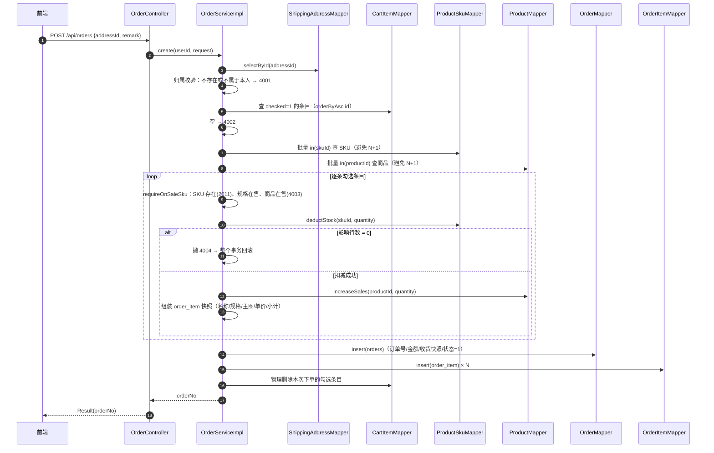
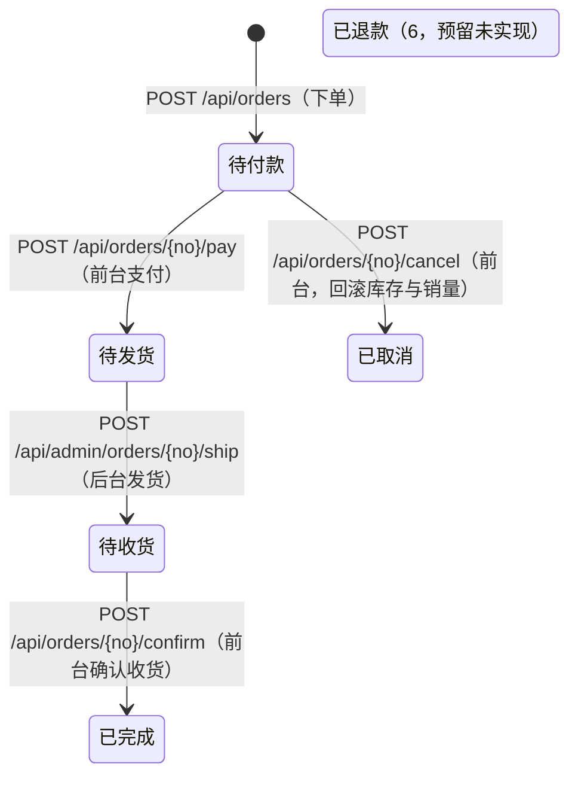

# 订单模块（spring-shop-order）技术梳理

本文档梳理 `spring-shop-order` 模块的实现，包含模块定位与依赖、分层结构、数据模型、下单主流程、库存并发方案、快照设计、订单状态机、接口与权限、测试基座与后续可扩展点。

## 一、模块职责与边界

**模块名**：`spring-shop-order`，隶属 spring-shop 单体业务模块之一，同时提供**前台接口（下单 / 地址）**与**后台接口（订单管理 / 发货）**。

- **上游依赖**：`spring-shop-common`（统一响应、JSR303 校验、`UserContext`）、`spring-shop-product`（复用 SKU / 商品只读查询与库存、销量增减）、`spring-shop-cart`（复用购物车勾选条目的读取与清理）。
- **下游被依赖**：`spring-shop-web`（启动模块），负责把 order 控制器扫入 Spring 容器、加载 Mapper。
- **依赖方向**：`web → order → {cart, product} → common`，单向无环。order 只读商品数据、回写库存/销量，不改动 cart / product 的业务规则。
- **当前范围**：收货地址 CRUD 与默认地址、购物车勾选项下单（快照 + 扣库存 + 清购物车）、我的订单分页 / 详情、支付 / 取消 / 确认收货、后台订单分页与发货。

**核心要点：** order 是项目里第一个「跨模块编排」的业务模块——它不重复实现商品校验或购物车读写，而是复用 cart / product 已暴露的 Mapper 与只读能力，通过单向依赖把「下单」串成一条事务链。

## 二、目录与分层结构

```
spring-shop-order/
└── src/main/java/com/springshop/order/
    ├── controller/OrderController.java              # 前台 /api/orders
    ├── controller/AddressController.java            # 前台 /api/addresses
    ├── controller/admin/AdminOrderController.java   # 后台 /api/admin/orders
    ├── dto/{OrderCreateRequest, OrderPageQuery, AdminOrderPageQuery, AddressSaveRequest}.java
    ├── entity/{Order, OrderItem, ShippingAddress}.java
    ├── enums/OrderStatus.java
    ├── mapper/{OrderMapper, OrderItemMapper, ShippingAddressMapper}.java
    ├── service/{OrderService, AddressService}.java
    ├── service/impl/{OrderServiceImpl, AddressServiceImpl}.java
    └── vo/{OrderVO, OrderItemVO, AddressVO}.java
```

- 与 cart 模块一致采用扁平分层（不按子域拆包），因为订单只有一个业务对象 + 收货地址这一附属对象。
- 后台控制器单独放 `controller/admin/` 子包，与 product 模块的 `controller/admin` 约定对齐。
- 严格遵循 AGENTS.md 分层：`controller → service(interface + impl) → mapper/entity`，入参 DTO、出参 VO，业务失败统一抛 `BusinessException`。

## 三、数据模型（复用 V3 Flyway 脚本）

表：`shipping_address / orders / order_item`（定义在 [V3__init_order_schema.sql](spring-shop-web/src/main/resources/db/migration/V3__init_order_schema.sql)），**本模块未新增任何迁移脚本**。

| 表 | 说明 |
|----|------|
| `shipping_address` | 收货地址，`user_id` 建索引；`is_default` 标记默认地址（业务保证同一用户唯一） |
| `orders` | 订单主表，表名用 `orders`（`order` 是 MySQL 保留字）；`uk_order_no` 唯一键；`status`、`user_id` 建索引 |
| `order_item` | 订单明细，`order_id` 建索引；冗余商品快照字段 |

关键约束：

1. 订单 / 明细的状态时间字段（`pay_time / ship_time / finish_time / cancel_time`）随状态流转写入。
2. 金额统一 `DECIMAL(10,2)`，Java 侧用 `BigDecimal`，不使用浮点型。
3. 三张表都带 `is_deleted`（逻辑删除）+ `version`（乐观锁），实体均映射。

> 集成测试用的 `migration-test/V3__init_order_schema.sql` 已把索引名全局唯一化（`idx_address_user_id` / `idx_order_user_id` / `idx_order_status`），满足 H2 索引名库级唯一的 CI 红线。

## 四、错误码段位

[ResultCode.java](spring-shop-common/src/main/java/com/springshop/common/result/ResultCode.java) 订单模块占用 4000 段：

```
4001 ORDER_ADDRESS_NOT_FOUND   收货地址不存在
4002 ORDER_CART_EMPTY          请先勾选要下单的商品
4003 ORDER_SKU_UNAVAILABLE     商品已下架或规格已停售
4004 ORDER_STOCK_INSUFFICIENT  商品库存不足
4005 ORDER_NOT_FOUND           订单不存在
4006 ORDER_STATUS_ILLEGAL      当前订单状态不支持该操作
```

同时**复用商品模块错误码**（同域语义，不重复造码）：

- `2011 PRODUCT_SKU_NOT_FOUND`：下单时勾选条目对应的 SKU 已被删除。
- `2014 PRODUCT_OFF_SHELF`（在 cart 模块加购时使用，下单链路由 `4003` 覆盖在售校验）。

## 五、下单主流程（OrderServiceImpl#create）

入口：`POST /api/orders`，body 只有 `{addressId, remark}`，**下单来源固定为当前用户购物车的勾选项**。



**核心要点：** 整个 `create` 方法在一个 `@Transactional(rollbackFor = Exception.class)` 事务内，顺序为「校验 → 扣库存 → 写订单/明细 → 清购物车」。任一步失败（含库存不足）都会整体回滚——已扣的库存、已加的商品销量、已插入的订单、已删的购物车条目**全部回退**，绝不留脏数据。

关键实现细节（[OrderServiceImpl.java](spring-shop-order/src/main/java/com/springshop/order/service/impl/OrderServiceImpl.java)）：

- 地址归属校验：`address == null || !Objects.equals(address.getUserId(), userId)` 一律抛 `4001`，避免用他人地址下单。
- 购物车条目按 `userId + checked=1` 过滤，`orderByAsc(id)` 保证多条目顺序稳定；为空抛 `4002`。
- 批量查 SKU / 商品组装成 Map，逐条在 Map 里取，避免循环内查询（N+1）。
- 在售校验 `requireOnSaleSku`：SKU 不在批量结果中 → `2011`；SKU `status != 1` 或所属商品不存在 / `status != 1` → `4003`。
- 订单号规则：`yyyyMMddHHmmssSSS`（17 位）+ userId 后 3 位 + 3 位随机数，共 23 位，`uk_order_no` 兜底，不做重试。
- `payAmount` 暂等于 `totalAmount`（无优惠券 / 运费）。

## 六、库存并发方案：条件更新扣减

商品侧新增两个条件更新 SQL（[ProductSkuMapper.java](spring-shop-product/src/main/java/com/springshop/product/product/mapper/ProductSkuMapper.java) / [ProductMapper.java](spring-shop-product/src/main/java/com/springshop/product/product/mapper/ProductMapper.java)）：

```sql
-- 扣减：库存充足才生效，影响行数 0 即库存不足
UPDATE product_sku SET stock = stock - #{quantity}, version = version + 1
 WHERE id = #{skuId} AND stock >= #{quantity}

-- 回滚（取消订单） / 销量回滚用 GREATEST 防止减成负数
UPDATE product_sku SET stock = stock + #{quantity}, version = version + 1 WHERE id = #{skuId}
UPDATE product    SET sales = GREATEST(sales - #{quantity}, 0), version = version + 1 WHERE id = #{productId}
```

**核心要点：** 把「判断库存」和「扣减库存」合并进**一条 UPDATE**，由数据库的行锁保证原子性。并发下要么这条 SQL 成功扣减，要么因 `stock >= quantity` 不成立而返回影响行数 0，业务据此抛 `4004`——不存在「先查再扣」中间被插队的竞态窗口。

| 方案 | 做法 | 优点 | 代价 | 本项目取舍 |
|------|------|------|------|-----------|
| **条件更新（当前）** | 单条 `UPDATE ... WHERE stock >= ?`，看影响行数 | 无需额外中间件；原子、代码极简；失败可精确回滚 | 高并发下同一 SKU 会串行争锁；失败即整单重试由用户承担 | ✅ 采用 |
| 分布式锁 / Redis 预扣 | 先锁住 SKU 或用 Redis 预占库存，再落库 | 峰值抗压、削峰 | 引入锁与缓存一致性、失效补偿的复杂度，与当前单体架构阶段的复杂度预算不匹配 | ❌ 暂不做 |
| 悲观锁 `SELECT ... FOR UPDATE` | 事务内先锁行再判断 | 语义直观 | 长时间持锁、易死锁，并发吞吐差 | ❌ 不采用 |

**为什么当前阶段选它**：库存扣减是电商最典型的并发点，条件更新用一条 SQL 就实现了「原子性 + 影响行数判定」的核心逻辑，且天然与事务回滚配合；分布式锁 / Redis 预扣属于规模化阶段的优化，当前业务量级下收益暂不抵引入的复杂度（详见 `docs/collaboration-plan.md` 第五节的规划）。

## 七、快照设计：历史订单不漂移

订单落库时把「下单那一刻」的关键信息全部冗余下来，**后续修改地址或商品不会影响历史订单**：

| 快照落点 | 字段 | 来源 |
|----------|------|------|
| `orders`（收货信息快照） | `receiver_name` / `receiver_phone` / `receiver_address` | 下单时从 `shipping_address` 复制；地址由「省 + 市 + 区 + 详细地址」拼接（`joinAddress`） |
| `orders`（金额快照） | `total_amount` / `pay_amount` | 由各明细小计累加，`BigDecimal` 计算 |
| `order_item`（商品快照） | `product_name` / `sku_specs` / `product_image` / `price`（成交单价） / `quantity` / `subtotal` | 下单时从 `product` / `product_sku` 复制 |

**核心要点：** 快照让订单成为「不可变的历史凭证」——商品改名、改价、下架，或用户删地址、改电话，都不会改写已生成订单的展示与金额。查询订单时直接读 `orders` / `order_item` 自身字段，**不再回查 product / shipping_address**，因此历史订单永远稳定可追溯。

## 八、订单状态机

状态定义见 [OrderStatus.java](spring-shop-order/src/main/java/com/springshop/order/enums/OrderStatus.java)（与 `orders.status` 一一对应）：



| 流转 | 入口接口 | 触发方 | 前置状态 | 目标状态 | 时间字段 |
|------|----------|--------|----------|----------|----------|
| 下单 | `POST /api/orders` | 前台 | — | 1 待付款 | `create_time` |
| 支付 | `POST /api/orders/{orderNo}/pay` | 前台 | 1 待付款 | 2 待发货 | `pay_time` |
| 发货 | `POST /api/admin/orders/{orderNo}/ship` | 后台 | 2 待发货 | 3 待收货 | `ship_time` |
| 确认收货 | `POST /api/orders/{orderNo}/confirm` | 前台 | 3 待收货 | 4 已完成 | `finish_time` |
| 取消 | `POST /api/orders/{orderNo}/cancel` | 前台 | 1 待付款 | 5 已取消 | `cancel_time` |

**核心要点：**

- 状态流转集中在私有方法 `requireOrder(userId, orderNo, expect)` 里校验：先按 `orderNo + userId` 查订单，**订单不存在或越权一律 `4005`**，再比对期望状态，**非法流转统一 `4006`**，杜绝散落的 if 判断。
- `cancel` 是唯一带副作用的流转：在 `@Transactional` 内逐条读明细，`restoreStock` 回滚库存 + `decreaseSales` 回滚销量，与状态变更同事务；**只有「待付款」可取消，已支付订单不可取消**（退款属后续迭代）。
- `ship` 由后台调用，无 `userId` 概念，直接按 `orderNo` 查（不存在 `4005`，状态不符 `4006`）。
- 状态 `6 已退款` 已在枚举与建表脚本中预留，但**没有任何接口会写入它**（属 YAGNI）。

## 九、接口清单

### 9.1 前台收货地址（需登录，`/api/addresses`）

| 方法 | 路径 | 说明 |
|------|------|------|
| GET | `/api/addresses` | 我的地址列表（默认地址排最前，再按 id 倒序） |
| POST | `/api/addresses` | 新增地址；`isDefault=true` 时先清空其他地址的默认标记 |
| PUT | `/api/addresses/{id}` | 修改地址（归属校验，失败 4001） |
| PUT | `/api/addresses/{id}/default` | 设为默认地址（先清旧默认再置新默认） |
| DELETE | `/api/addresses/{id}` | 删除地址（归属校验，失败 4001） |

### 9.2 前台订单（需登录，`/api/orders`）

| 方法 | 路径 | 说明 |
|------|------|------|
| POST | `/api/orders` | 下单，body `{addressId, remark}`，返回订单号 |
| GET | `/api/orders` | 我的订单分页（`current` / `size` / `status`） |
| GET | `/api/orders/{orderNo}` | 订单详情（含明细快照，越权返回 4005） |
| POST | `/api/orders/{orderNo}/pay` | 模拟支付：待付款 → 待发货 |
| POST | `/api/orders/{orderNo}/cancel` | 取消订单：待付款 → 已取消（回滚库存与销量） |
| POST | `/api/orders/{orderNo}/confirm` | 确认收货：待收货 → 已完成 |

### 9.3 后台订单（`/api/admin/orders`，需管理员 + 权限码）

| 方法 | 路径 | 权限码 | 说明 |
|------|------|--------|------|
| GET | `/api/admin/orders` | `order:order:list` | 订单分页（`orderNo` 模糊 + `status` 过滤，不按用户隔离） |
| POST | `/api/admin/orders/{orderNo}/ship` | `order:order:ship` | 发货：待发货 → 待收货 |

**安全配置零改动**：

- `/api/orders/**`、`/api/addresses/**` **不在** [SecurityConfig](spring-shop-web/src/main/java/com/springshop/web/security/SecurityConfig.java#L88-L94) 前台链的白名单里，被 `anyRequest().authenticated()` 覆盖，天然要求登录。
- `/api/admin/orders/**` 命中后台链 `securityMatcher("/api/admin/**")`，必须由 `AdminUserPrincipal` 身份访问（前台用户 token 会被拒绝），方法级再叠加 `@PreAuthorize` 权限码校验。

## 十、权限与菜单登记的坑

后台接口要生效，需**两处同时登记**（漏一处要么 403、要么方法级鉴权异常）：

1. [AdminDataInitializer#buildMenus](spring-shop-admin/src/main/java/com/springshop/admin/config/AdminDataInitializer.java#L133-L135) 注册菜单与按钮权限：`订单管理`（目录）→ `订单列表`（`order:order:list`）→ `订单发货`（`order:order:ship`）。
2. [AdminOrderController](spring-shop-order/src/main/java/com/springshop/order/controller/admin/AdminOrderController.java) 方法上标注同值 `@PreAuthorize("hasAuthority('order:order:list')")` / `hasAuthority('order:order:ship')`。

**⚠️ 已初始化过的库不会自动补菜单：** `AdminDataInitializer` 只在 `adminUserMapper.selectCount(null) > 0` 为假（即 `admin_user` 表为空）时执行一次，之后即使新增了订单菜单代码也**不会再跑**。若本地库早已初始化，订单菜单不会自动出现，表现为后台请求 403。处理方式：

- 重建库后重启（`DROP DATABASE spring_shop` 再 `mvn -pl spring-shop-web -am spring-boot:run`），让初始化器重新写入；
- 或登录后台在「菜单管理」里手动补「订单管理 / 订单列表 / 订单发货」三个节点（注意权限码与 `@PreAuthorize` 完全一致），并给 ADMIN 角色授权。

## 十一、测试基座

### 11.1 单元测试（纯 Mockito，无需 Spring / MySQL / Redis）

- [OrderServiceImplTest](spring-shop-order/src/test/java/com/springshop/order/service/impl/OrderServiceImplTest.java)（17 用例）：
  - **下单**：地址越权 4001 / 无勾选条目 4002 / 勾选 SKU 已删 2011 / 商品下架 4003 / 扣减返回 0 得 4004 / 成功下单断言订单号长度 23 与收货快照、明细快照、状态=1 / **仅删除本次勾选条目**（校验删除 wrapper 含 `IN` 且占位符为 1 个 userId + N 个条目 id）。
  - **查询**：我的分页按用户+状态过滤并聚合明细 / 详情不存在 4005 / 详情含明细快照 / 后台分页不按用户隔离。
  - **状态流转**：pay→待发货 / pay 非法状态 4006 / cancel 回滚库存与销量并置 5 / confirm→已完成 / ship→待收货 / ship 订单不存在 4005。
- [AddressServiceImplTest](spring-shop-order/src/test/java/com/springshop/order/service/impl/AddressServiceImplTest.java)（6 用例）：新增默认地址清旧默认 / 非默认不清 / 列表默认在前 / 修改越权 4001 / 设默认先清后设（`InOrder` 校验顺序） / 删除不存在 4001。

两者都用 `@BeforeAll warmupMybatisPlusLambdaCache()` 手动 `TableInfoHelper.initTableInfo` 预热 `LambdaQueryWrapper` 的 lambda 元数据，类上 `@MockitoSettings(strictness = LENIENT)` 兼容共享桩。

### 11.2 集成测试

[OrderIntegrationTest](spring-shop-web/src/test/java/com/springshop/web/OrderIntegrationTest.java)（10 用例，H2 + Flyway `db/migration-test` + MockMvc），类头满足「四件套 + Redis Mock」：`@SpringBootTest` + `@AutoConfigureMockMvc` + `@ActiveProfiles("test")` + `@Transactional` + `@MockBean StringRedisTemplate`。

关键守门用例：

- `orders_should_require_login`：未登录访问 `/api/orders` → 401（安全白名单零改动的守门测试）。
- `create_order_should_return_4004_and_rollback_stock_when_short`：先把库存扣成 0 制造不足，下单返回 4004，且**断言库存未被扣成负数、购物车条目仍在**（事务回滚守门）。
- `cancel_should_restore_stock_and_keep_order`：下单后库存 8，取消后回到 10，订单状态变 5 且仍可查询（取消回滚库存守门）。
- `create_order_with_others_address_should_return_4001` / `detail_of_others_order_should_return_4005`：越权守门。
- `pay_then_ship_then_confirm_should_follow_status_flow`：前台支付 → 后台发货 → 前台确认收货，最终 status=4。
- `admin_orders_should_reject_front_user_token`：前台用户 token 访问 `/api/admin/orders` → 401（双过滤链隔离守门）。

### 11.3 运行命令

```bash
# 仅跑 order 模块单测
mvn -pl spring-shop-order -am test -Dsurefire.failIfNoSpecifiedTests=false

# 仅跑订单集成测试
mvn -pl spring-shop-web -am test -Dtest=OrderIntegrationTest -Dsurefire.failIfNoSpecifiedTests=false

# 全量回归（等价 CI）
mvn clean verify
```

## 十二、暂不做（YAGNI）

1. **真实支付网关与异步回调**：当前 `pay` 只是把状态从 1 改为 2 的模拟支付。
2. **退款**：状态 `6 已退款` 已在枚举与建表脚本预留，但无任何接口写入。
3. **待付款超时自动取消**：需 `@Scheduled` 定时任务扫描超时订单并回滚库存。
4. **「立即购买」**：不经过购物车直接下单，需另开入参契约。
5. **优惠券 / 运费 / 积分抵扣**：故当前 `payAmount == totalAmount`。
6. **物流轨迹 / 发票 / 订单导出**：属于后续迭代规划。

## 十三、关键文件一览

- [父 pom.xml](pom.xml#L27)（注册 order 模块 + 声明版本，排在 cart 之后）
- [spring-shop-order/pom.xml](spring-shop-order/pom.xml)（依赖 common + product + cart + mybatis-plus + validation + spring-security-core）
- [spring-shop-web/pom.xml](spring-shop-web/pom.xml)（依赖 order）
- [ResultCode.java](spring-shop-common/src/main/java/com/springshop/common/result/ResultCode.java#L37-L43)（4000 段订单错误码）
- [ProductSkuMapper.java](spring-shop-product/src/main/java/com/springshop/product/product/mapper/ProductSkuMapper.java) / [ProductMapper.java](spring-shop-product/src/main/java/com/springshop/product/product/mapper/ProductMapper.java)（库存 / 销量条件更新）
- [AdminDataInitializer.java](spring-shop-admin/src/main/java/com/springshop/admin/config/AdminDataInitializer.java#L133-L135)（订单菜单与发货按钮权限）
- [SecurityConfig.java](spring-shop-web/src/main/java/com/springshop/web/security/SecurityConfig.java#L88-L94)（前后台双过滤链，订单 / 地址天然要求登录）
- [V3__init_order_schema.sql](spring-shop-web/src/main/resources/db/migration/V3__init_order_schema.sql)（orders / order_item / shipping_address 建表）
- [OrderServiceImpl.java](spring-shop-order/src/main/java/com/springshop/order/service/impl/OrderServiceImpl.java) / [AddressServiceImpl.java](spring-shop-order/src/main/java/com/springshop/order/service/impl/AddressServiceImpl.java)
- [OrderController.java](spring-shop-order/src/main/java/com/springshop/order/controller/OrderController.java) / [AddressController.java](spring-shop-order/src/main/java/com/springshop/order/controller/AddressController.java) / [AdminOrderController.java](spring-shop-order/src/main/java/com/springshop/order/controller/admin/AdminOrderController.java)
- [OrderServiceImplTest.java](spring-shop-order/src/test/java/com/springshop/order/service/impl/OrderServiceImplTest.java) / [AddressServiceImplTest.java](spring-shop-order/src/test/java/com/springshop/order/service/impl/AddressServiceImplTest.java) / [OrderIntegrationTest.java](spring-shop-web/src/test/java/com/springshop/web/OrderIntegrationTest.java)
