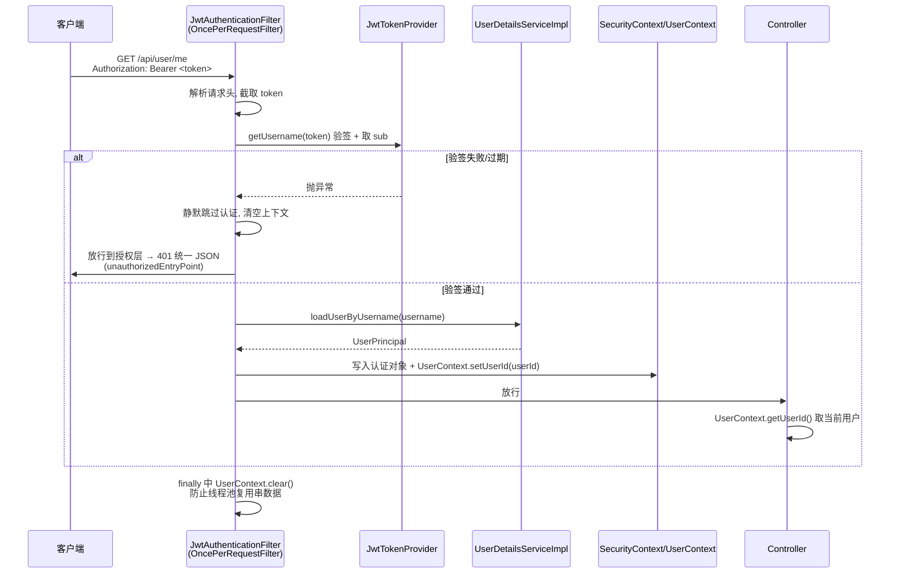

# 用户模块技术梳理

> 面向接手者：本文梳理用户模块的全部逻辑、登录流程、技术方案细节与流程图，帮助快速理解代码。配套协作规范见 [AGENTS.md](../AGENTS.md)。

## 一、模块结构总览

```
spring-shop-user（业务模块，依赖 common）
├── controller
│   ├── AuthController      # 认证接口：注册 / 登录（匿名可访问）
│   └── UserController      # 用户接口：当前用户信息（需登录）
├── service
│   ├── UserService         # 接口
│   └── impl/UserServiceImpl # 业务实现（唯一含业务逻辑的地方）
├── mapper/UserMapper       # 继承 BaseMapper<User>，无自定义 SQL
├── entity/User             # user 表映射实体
├── dto
│   ├── RegisterRequest     # 注册入参（带校验注解）
│   └── LoginRequest        # 登录入参
├── vo
│   ├── UserInfoVO          # 用户出参（不含密码）
│   └── LoginResponse       # 登录出参 = token + UserInfoVO
└── security                 # Spring Security 适配层
    ├── UserPrincipal       # 把 User 适配成 UserDetails
    └── UserDetailsServiceImpl # 按用户名查库

spring-shop-common（公共，禁止业务逻辑）
└── security
    ├── JwtTokenProvider    # JWT 签发 / 验签
    └── UserContext         # ThreadLocal 存当前用户 id

spring-shop-web（启动模块）
└── security
    ├── SecurityConfig      # 过滤器链 / 白名单 / 401 处理
    └── JwtAuthenticationFilter # 每个请求执行一次的认证过滤器
```

**架构约定**：`UserDetailsServiceImpl` / `UserPrincipal` 必须放在 user 模块而非 common 模块——按用户名查库属于用户业务，而 common 模块禁止出现业务逻辑。`JwtTokenProvider`（纯签名/验签，不涉及业务）放 common，供后续商品、订单等模块复用。

## 二、技术方案细节（核心设计决策）

| 设计点 | 方案 | 为什么 |
|--------|------|--------|
| 密码存储 | BCrypt（`BCryptPasswordEncoder`），自动加盐 | 同一明文每次加密结果不同，防彩虹表 |
| 登录凭证 | 无状态 JWT（HS256，过期 2h），服务端不存 session | 天然支持水平扩展，无需 session 同步 |
| 主体区分 | token 内增加 `userType=USER` claim | 与管理后台 `ADMIN` token 区分，避免前后台越权 |
| 会话管理 | `SessionCreationPolicy.STATELESS` + 关闭 CSRF | 登录态全靠 JWT 请求头，无 cookie 就无 CSRF 攻击面 |
| 用户标识传递 | `ThreadLocal`（`UserContext`），由过滤器写入 | Controller 无需在入参传 userId，请求内共享、请求间隔离 |
| 用户名枚举防护 | 用户不存在与密码错误统一返回 `PASSWORD_ERROR` | 不暴露"该用户名是否已注册" |
| 密码泄漏防护 | 实体字段不返回前端，VO 只暴露 id/username/nickname/phone | 见 `UserServiceImpl.convertToVO` |
| 敏感信息落库 | secret 走环境变量 `${JWT_SECRET:...}`，默认值仅开发用 | HS256 要求 secret ≥ 32 字节 |
| 数据层 | 逻辑删除（`@TableLogic`）+ 乐观锁（`@Version`）+ 字段自动填充 | 全项目统一设计，订单/商品沿用 |
| 参数校验 | DTO 注解 + `@Valid`，异常由 `GlobalExceptionHandler` 兜底 | Controller 零校验代码 |

## 三、接口逐一梳理

### 1. 注册 `POST /api/auth/register`（匿名）

**入参校验**（`RegisterRequest` 注解，违反则 400）：

- username：`@NotBlank` + 4~20 位
- password：`@NotBlank` + 6~32 位
- nickname：≤ 20 位（可选）
- phone：`^1[3-9]\d{9}$`（可选）

**业务逻辑**（`UserServiceImpl.register`）：

1. 按 username 查库，存在则抛 `USERNAME_EXISTS(1001)`（先查后插）
2. `passwordEncoder.encode()` 加密密码
3. nickname 缺省时回退为 username
4. status 固定为 1，`userMapper.insert()` 落库
5. MyBatis-Plus 自动填充 `createTime` / `updateTime`（`MyMetaObjectHandler`）

### 2. 登录 `POST /api/auth/login`（匿名）— 见第四节流程图

### 3. 当前用户 `GET /api/user/me`（需登录）

1. 认证过滤器已把 userId 写入 `UserContext`，Controller 直接 `UserContext.getUserId()`
2. 查库 → 转 VO 返回；查不到抛 `USER_NOT_FOUND(1002)`

## 四、登录逻辑流程图

```mermaid
flowchart TD
    A[客户端 POST /api/auth/login<br/>携带 username + password] --> B{@Valid 参数校验}
    B -- 失败 --> B1[GlobalExceptionHandler<br/>返回 400 参数错误]
    B -- 通过 --> C[UserServiceImpl.login]
    C --> D[userMapper.selectOne<br/>按 username 查库]
    D --> E{user 存在?}
    E -- 否 --> F[抛 BusinessException<br/>PASSWORD_ERROR 1003<br/>统一提示用户名或密码错误]
    E -- 是 --> G{passwordEncoder.matches<br/>明文 vs BCrypt 密文?}
    G -- 不匹配 --> F
    G -- 匹配 --> H{user.status == 1?}
    H -- 否 --> I[抛 BusinessException<br/>USER_DISABLED 1004]
    H -- 是 --> J[jwtTokenProvider.generateToken<br/>subject=username, claim=userId + userType=USER<br/>过期 2h, HS256 签名]
    J --> K[返回 LoginResponse<br/>token + UserInfoVO]
    K --> L[前端保存 token<br/>后续请求头带 Authorization: Bearer token]
```

## 五、认证请求链路（每次请求都走一遍）



**关键点**：

- 过滤器挂在 `UsernamePasswordAuthenticationFilter` **之前**（`addFilterBefore`）
- 当前项目已演进为**前后台双过滤链**：`/api/admin/**` 走管理员链，前台接口继续走用户链；前台用户 token 无法访问后台接口
- 白名单 `/api/auth/**`、`/api/health`、Swagger 路径匿名可访问，其余接口全部要求认证（`SecurityConfig`）
- 未认证返回 `401` + `Result.fail(UNAUTHORIZED)`，而非 403

## 六、数据库表（`user`）

| 字段 | 类型 | 说明 |
|------|------|------|
| id | BIGINT 自增 | 主键 |
| username | VARCHAR(50) UNIQUE | 用户名 |
| password | VARCHAR(100) | BCrypt 密文 |
| nickname / phone | VARCHAR | 可选 |
| status | TINYINT | 1 正常 / 0 禁用 |
| create_time / update_time | DATETIME | 自动填充 |
| is_deleted | TINYINT | 逻辑删除（`@TableLogic`） |
| version | INT | 乐观锁（`@Version`） |

## 七、接手时的注意点（易踩坑）

1. **`UserDetailsServiceImpl` 不是登录入口**：它只供 Spring Security 每次请求认证时按用户名加载用户。真正的"账号密码校验 + 签发 token"逻辑在 `UserServiceImpl.login`，两条路径独立。
2. **`UserContext.clear()` 必不可少**：请求结束不清理的话，Tomcat 线程池复用时下一个请求会读到上一个用户的 id。
3. **前台 token 现在带 `userType=USER`，但仍然不带角色权限**：`UserPrincipal.getAuthorities()` 返回空集合，目前 `@EnableMethodSecurity` 已开启但前台侧尚未引入 RBAC；后台 RBAC 已独立放在 `spring-shop-admin`。
4. **JWT 无状态 = 无法主动踢人**：禁用用户只是登录时校验 status，已签发的 token 在过期前仍有效。
5. **校验异常统一被 `GlobalExceptionHandler` 处理**，返回 400 + 第一个字段错误信息，不是 Spring 默认格式。
